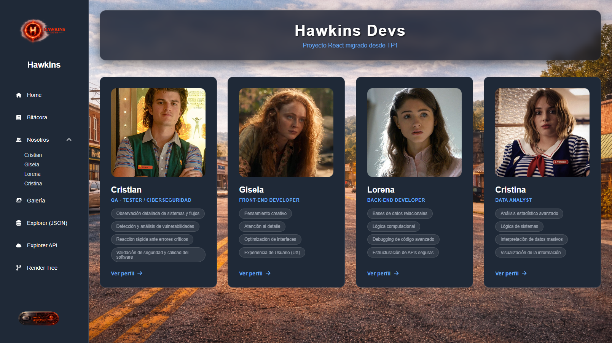
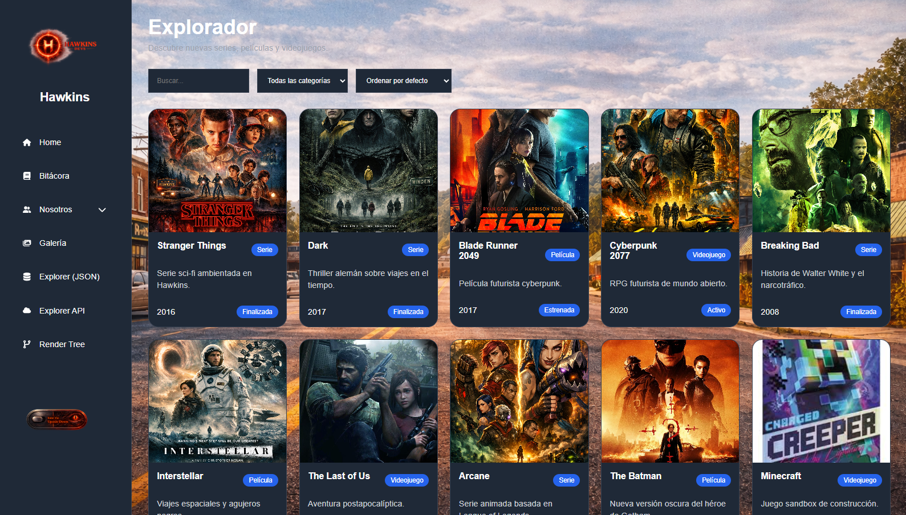
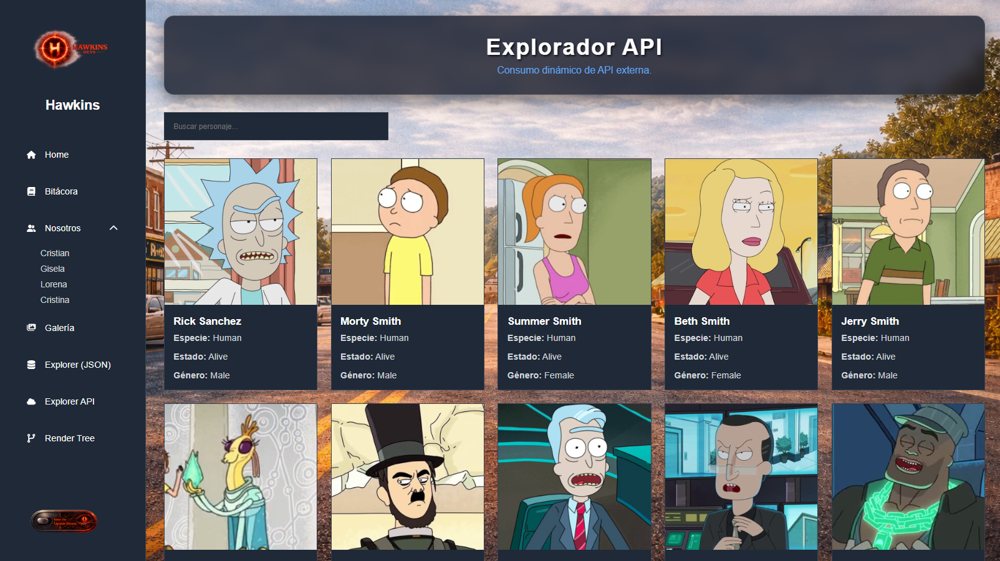
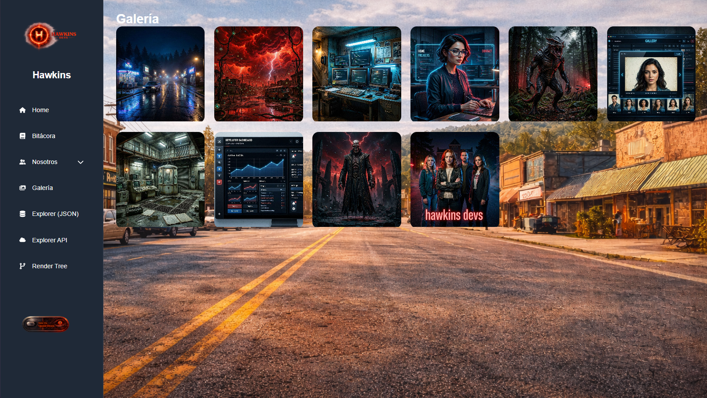

# 🚀 Strange Project — TP2 React

## 🌐 Deploy del Proyecto

🔗 [Ver proyecto online](https://TU-DEPLOY.vercel.app)

---

# 📌 Descripción

Strange Project es una aplicación web desarrollada como parte del Trabajo Práctico Grupal 2 de Frontend.

El proyecto consiste en la migración del TP1, originalmente realizado con HTML, CSS y JavaScript, hacia una arquitectura moderna basada en React.

La aplicación fue desarrollada utilizando una estructura de componentes reutilizables, navegación SPA mediante React Router y un diseño tipo Dashboard con Sidebar fija.

Además, incorpora funcionalidades dinámicas como:

* Explorador de datos locales
* Consumo de APIs externas
* Galería interactiva
* Renderizado dinámico
* Navegación responsive
* Perfiles individuales

---

# 👥 Integrantes

| Nombre       | GitHub                     |
| ------------ | -------------------------- |
| **Lorena Cohene Baez** | <a href="https://github.com/LorenaCoheneBaez" target="_blank"></a> |
| **Gisela Colmeiro (Gisse)** | <a href="https://github.com/gissestephy" target="_blank"></a> |
| **Cristian Vivar** | <a href="https://github.com/ecvivar" target="_blank"></a> |
| **Cristina Murguía** | <a href="https://github.com/crismurbaez" target="_blank"></a> |

---

# 🛠 Tecnologías Utilizadas

## Frontend

* React
* Vite
* JavaScript
* CSS3
* HTML5

## Routing

* React Router DOM

## Librerías

* react-icons

## Herramientas

* GitHub
* Vercel
* VSCode

---

# 📁 Estructura del Proyecto

```bash
src/
│
├── assets/
├── components/
│   ├── cards/
│   ├── gallery/
│   ├── layout/
│
├── data/
├── pages/
├── routes/
├── styles/
│
├── App.jsx
└── main.jsx
```

---

# 🎨 Guía de Estilos

## Paleta de colores

| Color           | Código  |
| --------------- | ------- |
| Fondo principal | #111827 |
| Sidebar         | #1f2937 |
| Azul principal  | #60a5fa |
| Texto principal | #f9fafb |
| Bordes          | #374151 |

---

## Tipografías

* [Poppins](https://fonts.google.com/specimen/Poppins)
* [Inter](https://fonts.google.com/specimen/Inter)

---

## Iconografía

Librería utilizada:

* react-icons

---

# ⚙️ Funcionalidades Principales

## 🏠 Dashboard Home

* Grid dinámica de integrantes
* Navegación rápida
* Diseño responsive

---

## 👤 Perfiles Individuales

* Información personal
* Skills
* Carrusel de proyectos
* Render dinámico

---

## 🔍 JSON Explorer

* Renderizado dinámico
* Filtros en tiempo real
* Buscador interactivo

---

## 🌎 API Explorer

* Consumo de API pública
* Loading states
* Manejo de errores
* Paginación dinámica

---

## 🖼️ Galería Interactiva

* Grid responsive
* Lightbox
* Navegación entre imágenes
* Cierre mediante tecla ESC

---

## 🌳 Árbol de Renderizado

* Visualización de arquitectura de componentes
* Jerarquía de Layout y páginas

---

## 📖 Bitácora

* Documentación del proceso de desarrollo
* Evolución TP1 → TP2
* Organización del equipo

---

# 📱 Responsive Design

El proyecto fue desarrollado utilizando diseño adaptable para:

* 📱 Mobile
* 📲 Tablet
* 💻 Desktop

Breakpoints implementados:

* 400px
* 900px
* 1200px

---

# 🧠 Uso de Inteligencia Artificial

## Herramientas utilizadas

* ChatGPT
* GitHub Copilot
* OpenCode

---

## Uso técnico

Las herramientas IA fueron utilizadas como asistencia para:

* debugging
* planificación de arquitectura
* mejoras de componentes React
* optimización de CSS
* resolución de errores
* generación de ideas UI/UX

---

## Generación de contenido e imágenes

La IA fue utilizada para:

* avatares
* ideas visuales
* asistencia en prompts
* documentación técnica

---

# 🔄 Evolución del Proyecto

La transición del TP1 al TP2 representó un gran salto técnico y organizativo, pasando de un sitio web tradicional a una **Single Page Application (SPA)** moderna y escalable.

### 📉 Trabajo Práctico 1
* **Tecnologías Base:** HTML5, CSS3, JavaScript Vanilla.
* **Arquitectura:** Múltiples archivos `.html` independientes con navegación tradicional (recargas de página).
* **Desafíos:** Código repetitivo en múltiples vistas (menús, pies de página) y manipulación manual y tediosa del DOM.

### 📈 Trabajo Práctico 2
* **Tecnologías Base:** React, Vite, React Router DOM.
* **Arquitectura:** Desarrollo basado en **componentización**. La interfaz se dividió en piezas reutilizables (Sidebar, Lightbox, Cards) con un único `index.html` y navegación SPA sin recargas.
* **Nuevos Logros:** Renderizado dinámico de datos locales (JSON), consumo asíncrono de APIs externas con manejo de errores y estados de carga, y lógica avanzada.

---

# 📸 Capturas del Proyecto

## Home



---

## Explorer



---

## API Explorer



---

## Galería



---

# 🚀 Instalación y ejecución

## Clonar repositorio

```bash
git clone https://github.com/USUARIO/REPOSITORIO.git
```

## Instalar dependencias

```bash
npm install
```

## Ejecutar proyecto

```bash
npm run dev
```

---

# 📦 Build de producción

```bash
npm run build
```

---

# 🌐 Deploy

Proyecto desplegado utilizando:

* Vercel

🔗 https://TU-DEPLOY.vercel.app

---

# 📌 Estado Actual del Proyecto

✅ Migración a React completada
✅ Navegación SPA implementada
✅ Sidebar Dashboard responsive
✅ Explorer dinámico
✅ Integración API
✅ Galería interactiva
✅ Responsive Design

---

# 📚 Conclusión

Este proyecto permitió aplicar conceptos modernos de desarrollo frontend utilizando React y arquitectura basada en componentes.

La migración desde una estructura estática hacia una SPA permitió mejorar la organización del código, la reutilización de componentes y la experiencia de usuario.